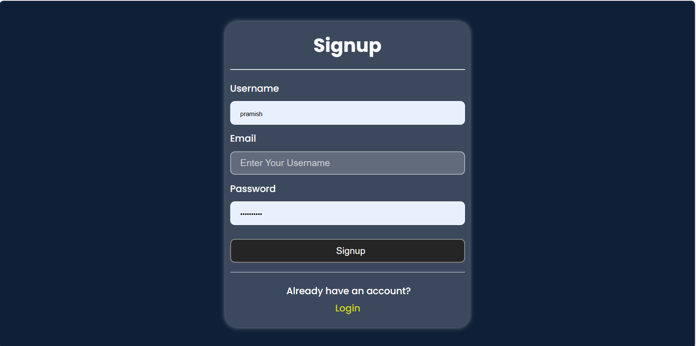
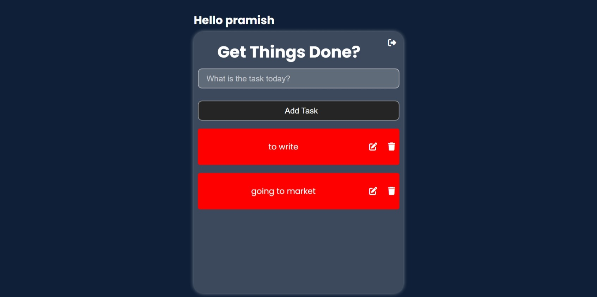

🚀 Features

✔ Create Tasks – Add your daily tasks easily
✔ Update Tasks – Edit and modify existing tasks
✔ Delete Tasks – Remove tasks you no longer need
✔ User Authentication – Login and Logout functionality
✔ Clean UI – Simple and user-friendly interface

📸 Demo Images

Replace the image paths with your own images.

📂 App Interface

📝 Task List Page

 

Upload your demo video and add the link below.

▶️ Todo App Demo

Click to watch video

[Click to watch demo](12-42-07.mp4)

🛠️ Tech Stack

Python 3

Django 5

HTML, CSS

SQLite (default) database
